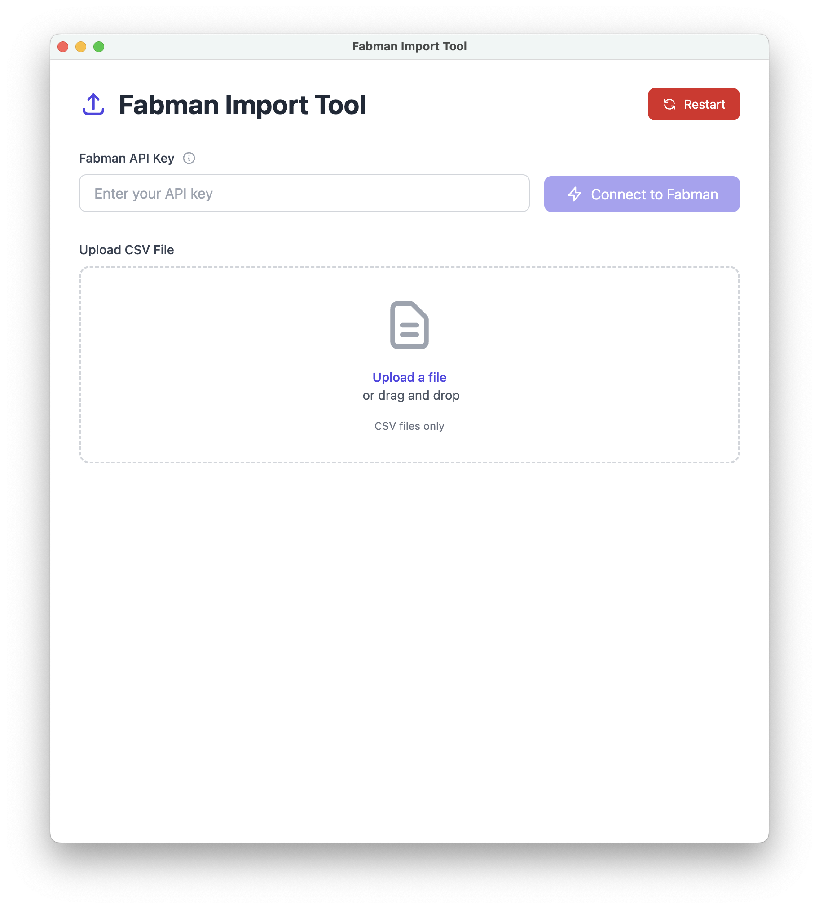
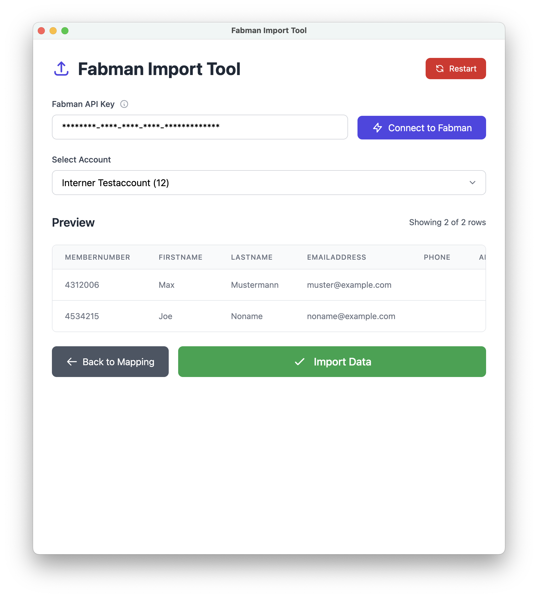

# Fabman Import Tool

An Electron application for importing CSV member data into Fabman.

<div style="display: flex; justify-content: space-between;">
    
    
</div>

## ✨ Features

### 🚀 **Core Functionality**
- **CSV file upload** with drag & drop support
- **Automatic field matching** - intelligently maps CSV columns to Fabman fields
- **Interactive field mapping** interface with visual feedback
- **Data preview** with pagination
- **Package assignment** - optional package assignment to imported members
- **Key management** - support for various key types (EM4102, NFCA, NFCB, etc.)
- **Direct import** to Fabman API

## 📋 Prerequisites

- **Node.js** v14 or higher
- **npm** v6 or higher
- **Fabman account** with admin/owner privileges
- **Valid Fabman API key**

## 🚀 Quick Start

### Installation

1. **Clone the repository**
   ```bash
   git clone <repository-url>
   cd fabman-import
   ```

2. **Install dependencies**
   ```bash
   npm install
   ```

### Development

**Start development server with hot CSS reload:**
```bash
npm run dev
```

**Or start just the Electron app:**
```bash
npm run start
```

### Building Executables

**Build for current platform:**
```bash
npm run build
```

**Platform-specific builds:**
```bash
npm run build:win     # Windows portable executable
npm run build:mac     # macOS portable application
npm run build:linux   # Linux AppImage
```

**Build outputs are created in the `dist/` directory.**

## 📖 Usage Guide

### 1. **API Key Setup**
- Click the ℹ️ icon next to "Fabman API Key" for step-by-step instructions
- Enter your Fabman API key
- Click "Connect to Fabman" to load your accounts

### 2. **CSV File Upload**
- **Drag & drop** a CSV file onto the upload area, or
- **Click "Upload a file"** to browse for your CSV
- The tool automatically parses and analyzes your data

### 3. **Field Mapping**
- **Automatic matching** runs immediately after upload
- **Review mappings** - green highlights indicate successful matches
- **Manual adjustment** - change any incorrect mappings using the dropdowns
- **Key type selection** - if mapping a key field, select the appropriate key type

### 4. **Package Assignment (Optional)**
- Select a package to assign to all imported members
- Leave blank for no package assignment

### 5. **Preview & Import**
- Click **"Generate Preview"** to see how your data will be imported
- Review the first 10 rows (click "Load all X rows" to see everything)
- Click **"Import Data"** to start the import process

## 📊 CSV File Requirements

### **Required Fields**
Your CSV must contain these fields (exact names may vary):
- **First Name** (firstName, first, given name, etc.)
- **Last Name** (lastName, last, surname, family name, etc.)
- **Email Address** (email, emailAddress, mail, etc.)

### **Optional Fields**
- **Member Number** (memberNumber, id, number, etc.)
- **Phone** (phone, telephone, mobile, etc.)
- **Address** (address, street, etc.)
- **City** (city, town, locality, etc.)
- **ZIP/Postal Code** (zip, postal, postcode, etc.)
- **Country Code** (country, countryCode, nation, etc.)
- **Region/State** (region, state, province, etc.)
- **Notes** (notes, comments, description, etc.)
- **Key** (key, rfid, card, token, etc.)


## 🏗️ Build System

The application uses **electron-builder** for packaging:

### **Windows Output**
- `Fabman Import Tool-1.0.0-portable.exe` - Portable executable (no installation required)

### **macOS Output**
- `Fabman Import Tool-1.0.0-mac.zip` - Portable application bundle

### **Linux Output**
- `Fabman Import Tool-1.0.0.AppImage` - Universal Linux application

### **Build Configuration**
All build settings are configured in `package.json` under the `"build"` section.

## 🔒 Security & Privacy

- **No data storage** - All data is processed in memory only
- **No API key persistence** - API keys are not saved between sessions
- **Session-only operation** - All data is cleared when the app closes

## 🛠️ Technology Stack

- **[Electron](https://electronjs.org/)** - Cross-platform desktop framework
- **[Alpine.js](https://alpinejs.dev/)** - Reactive JavaScript framework
- **[Tailwind CSS](https://tailwindcss.com/)** - Utility-first CSS framework
- **[PapaParse](https://www.papaparse.com/)** - CSV parsing library
- **[electron-builder](https://www.electron.build/)** - Application packaging

## 📁 Project Structure

```
fabman-import/
├── src/
│   ├── main.js          # Electron main process
│   ├── renderer.js      # Application logic & Alpine.js
│   ├── index.html       # Main UI
│   ├── styles.css       # Tailwind source
│   └── output.css       # Compiled Tailwind CSS
├── assets/
│   ├── icon.ico         # Windows icon
│   ├── icon.icns        # macOS icon
│   ├── icon.png         # Linux icon
│   └── icon-1024.png    # Source icon
├── dist/                # Build outputs
├── package.json         # Dependencies & build config
└── README.md
```

## 🤝 Contributing

1. Fork the repository
2. Create a feature branch
3. Make your changes
4. Test thoroughly
5. Submit a pull request

## 📄 License

MIT License - see LICENSE file for details.

---

**Built with ❤️ for the Fabman community** 